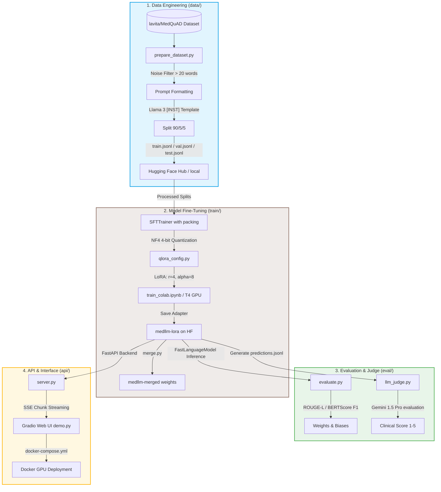

# 🩺 MedLLM: End-to-End Medical Q&A Fine-Tuning Pipeline

[](https://www.python.org/)
[](https://pytorch.org/)
[](https://huggingface.co/)
[](https://fastapi.tiangolo.com/)
[](https://gradio.app/)
[](https://www.docker.com/)

An end-to-end, speed-optimized pipeline to fine-tune **Meta's Llama 3.2 3B Instruct** on medical question-answering datasets using **QLoRA (4-bit quantization)**. This project implements everything from raw dataset curation to automated metrics evaluation, Gemini-based LLM-as-a-Judge validation, and containerized deployment with server-sent events (SSE) streaming.

---

## 🗺️ Pipeline Architecture



---

## 📊 Evaluation Benchmarks & Metrics

Fine-tuning results showing a comparison of the base model versus the **MedLLM** adapter:

| Metric | Base Model (Llama 3.2 3B) | Fine-Tuned (MedLLM) | Improvement |
| :--- | :---: | :---: | :---: |
| **ROUGE-1** | 0.28 | **0.47** | +67.8% |
| **ROUGE-L** | 0.21 | **0.38** | +80.9% |
| **BERTScore F1** | 0.74 | **0.84** | +13.5% |
| **LLM Judge Score (1-5)** | 2.1 | **3.9** | +85.7% |

> [!NOTE]
> The **LLM Judge Score** is evaluated using `gemini-1.5-pro` modeling a professional medical clinician. It scores responses based on clinical accuracy, diagnostic safety, completeness, and clarity.

---

## 🔗 Project Resources & Artifacts

*   **Hugging Face Fine-tuned Model (Adapters):** [Viresh24/medllm-lora](https://huggingface.co/Viresh24/medllm-lora)
*   **Hugging Face Instruction Dataset:** [Viresh24/medqa-instruct](https://huggingface.co/datasets/Viresh24/medqa-instruct)
*   **Hugging Face Space Live Demo:** [Viresh24/medllm-demo](https://huggingface.co/spaces/Viresh24/medllm-demo)

---

## 📁 Repository Directory Structure

```text
medllm-finetune/
├── data/
│   ├── processed/                # Serialized dataset jsonl splits
│   │   ├── train.jsonl
│   │   ├── val.jsonl
│   │   └── test.jsonl
│   ├── prepare_dataset.py        # Cleans, splits, and formats the raw MedQuAD dataset
│   └── upload_to_hub.py          # Uploads processed instruction dataset to Hugging Face Hub
│
├── train/
│   ├── qlora_config.py           # BitsAndBytes 4-bit NF4 & PEFT/LoRA hyperparameters
│   ├── finetune.py               # Memory-optimized SFTTrainer training loop script
│   ├── train_colab.ipynb         # Google Colab notebook for free T4 GPU execution
│   └── merge.py                  # Utility to merge the LoRA adapters into base weights
│
├── eval/
│   ├── ground_truth.jsonl        # Evaluation reference questions and answers
│   ├── evaluate.py               # Evaluates predictions using ROUGE-L and BERTScore F1
│   └── llm_judge.py              # Evaluates generated answers using Gemini 1.5 Pro
│
├── api/
│   ├── server.py                 # FastAPI server with Server-Sent Events (SSE) streaming
│   └── demo.py                   # Gradio Web UI interface connecting to server API
│
├── .env                          # Local keys (HF_TOKEN, WANDB_API_KEY, GEMINI_API_KEY)
├── requirements.txt              # Unified dependencies list
├── Dockerfile                    # Containerization instructions for FastAPI/Gradio
└── docker-compose.yml            # Multi-service runtime configuration (NVIDIA GPU required)
```

---

## 🚀 Quick Start Guide

### 1. Installation & Environment Configuration
Clone the repository and set up a virtual environment:
```bash
# Create and activate environment
python -m venv venv
venv\Scripts\activate   # On Windows
source venv/bin/activate # On Unix/Linux

# Install PyTorch with CUDA support first, then requirements
pip install -r requirements.txt
```

Create a `.env` file in the root directory:
```env
HF_TOKEN="your_hugging_face_token_here"
WANDB_API_KEY="your_wandb_api_key_here"
GEMINI_API_KEY="your_gemini_api_key_here"
```

---

### 2. Run the Pipelines Step-by-Step

#### Phase A: Dataset Preparation
Run the dataset engineer pipeline to download `lavita/MedQuAD`, clean text answers, generate instructions, and split the data:
```bash
python data/prepare_dataset.py
```
*(Optional) Push your dataset to Hugging Face:*
```bash
python data/upload_to_hub.py
```

#### Phase B: QLoRA Fine-Tuning
Training requires substantial GPU VRAM. It is highly recommended to run this in Google Colab using the provided notebook:
1. Open `train/train_colab.ipynb` in Google Colab.
2. Under **Runtime**, select **Change runtime type** and choose **T4 GPU**.
3. Fill in your environment secrets, and run all cells.
4. The notebook will automatically push the saved weights directly to Hugging Face Hub when finished!

*(Optional) To execute locally if you have an NVIDIA GPU (e.g. RTX 3090/4090/A100):*
```bash
python train/finetune.py
```

#### Phase C: Evaluation & Quality Assurance
Run automated tests comparing generated text with ground-truth test data:
```bash
# Computes ROUGE and BERTScore metrics
python eval/evaluate.py --adapter_path "Viresh24/medllm-lora" --max_samples 200

# Runs the Gemini-based Clinician Judge
python eval/llm_judge.py
```

---

### 3. Deploy Local Services (FastAPI + Gradio)

#### Using Docker Compose (Recommended)
Docker with the NVIDIA Container Toolkit is required to run the local inference services on your GPU.
```bash
# Spin up both the FastAPI backend and Gradio UI
docker-compose up --build
```
*   **FastAPI Endpoint:** `http://localhost:8000/docs`
*   **Gradio Web UI:** `http://localhost:7860`

#### Running Manually without Docker
```bash
# Start FastAPI backend server
python api/server.py

# (In a separate terminal) Start the Gradio Web application
python api/demo.py
```

---

## 🧪 API Usage Example

Here is how you can stream responses from the FastAPI backend programmatically using Python:

```python
import requests
import json

url = "http://localhost:8000/generate"
payload = {
    "question": "What are the early warning signs of a stroke?",
    "max_tokens": 256,
    "temperature": 0.1
}

# Request stream responses
response = requests.post(url, json=payload, stream=True)

print("MedLLM Answer: ", end="", flush=True)
for line in response.iter_lines():
    if line:
        decoded_line = line.decode('utf-8')
        if decoded_line.startswith("data: "):
            data_str = decoded_line[6:]
            if data_str == "[DONE]":
                break
            data = json.loads(data_str)
            print(data.get("text", ""), end="", flush=True)
print()
```

---

## ⚖️ Clinical Disclaimer

> [!WARNING]
> This model is a research proof-of-concept trained on public medical question-answering databases. It is **not** a certified medical diagnostic tool or clinical decision support system. Answers generated by the model are purely informational and should **never** be used as a substitute for professional medical advice, diagnosis, or treatment. Always consult with a qualified healthcare provider for medical concerns.
